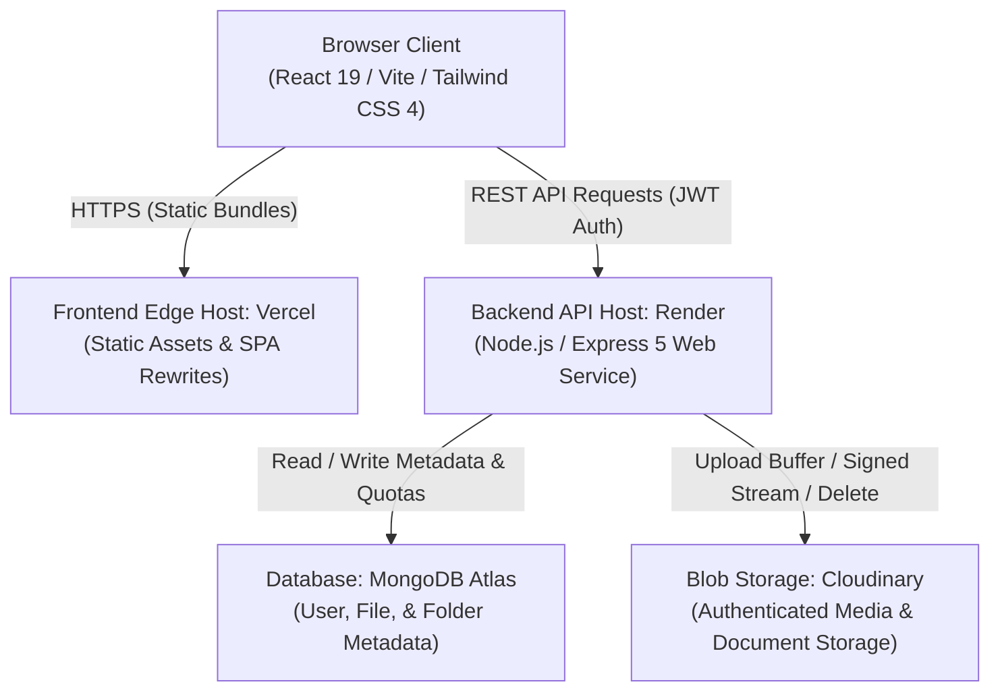

# CloudDrive

CloudDrive is a secure, personal cloud storage web application built with React 19, Node.js, Express 5, MongoDB Atlas, and Cloudinary. Designed as a modern alternative to commercial storage providers, it provides authenticated file management, hierarchical directory structures, cryptographic public link sharing, soft-deletion recovery lifecycles, and strict multi-tenant authorization controls.

[](https://cloud-drive-sage.vercel.app)
[](https://cloud-drive-a390.onrender.com/api/health)
[](server/package.json)

---

## Live Deployments

- **Web Application (Vercel Edge SPA):** [https://cloud-drive-sage.vercel.app](https://cloud-drive-sage.vercel.app)
- **API Health Check (Render Managed Service):** [https://cloud-drive-a390.onrender.com/api/health](https://cloud-drive-a390.onrender.com/api/health)

---

## Overview

CloudDrive is designed to deliver a private, personal file hosting environment. It decouples the client application from the backend API, allowing the static frontend to be distributed globally across edge networks while the REST API executes within a managed container environment.

### Problem Statement & Use Case
Many personal drive platforms enforce opaque telemetry, arbitrary bandwidth caps, and rigid organization. CloudDrive provides an auditable, self-managed storage layer where users retain complete ownership over their documents, photos, and project files.

### Scope of Version 1.0
- **Storage Scope:** Single-file uploads for verified PDF documents and JPEG/PNG images up to 5 MB per file.
- **Directory Scope:** Arbitrary depth hierarchical folder and subfolder organization.
- **Sharing Scope:** Cryptographically signed, token-based public links for individual files.
- **Account Scope:** Multi-tenant accounts with 5 GB storage quotas, bcrypt password protection, and instant session revocation.

---

## Key Features

### Authentication & Security
- Stateless JWT authentication signed with HMAC-SHA256 (HS256) with 7-day token lifespans.
- Incremental `tokenVersion` mechanism on user accounts, providing immediate session invalidation across all client sessions on logout or password change.
- Multi-tiered brute-force rate limiting: dual-layer protection on login (IP-based and account-based) alongside dedicated limits on registration and password updates.
- Strict multi-tenant boundary checks: all file and folder operations verify ownership against the authenticated token subject.
- Defensive HTTP security headers via Helmet and Content Security Policy (CSP) enforcement on frontend hosts.

### File Management
- Single-file upload via standard system file picker.
- Deep buffer inspection verifying magic-byte headers for PNG, JPEG, and PDF formats to prevent MIME spoofing.
- Cloudinary authenticated blob storage with signed delivery streaming.
- In-place file renaming preserving original extensions and cloud identifiers.
- Atomic storage quota reservation and automated rollback handling on failure.

### Folder Management
- Hierarchical folder creation supporting infinite nesting via parent-folder references.
- Safe folder deletion rules: prevents accidental deletion if active files or subfolders reside inside the target folder.
- Automated disassociation: trashed files associated with deleted folders are automatically detached to prevent orphaned hierarchies upon restore.

### Search
- Instant client-side filename filtering across loaded records in the browser.
- Backend regex search route with character escaping to mitigate ReDoS and injection attempts.

### Favorites
- One-click file starring with dedicated filtered views.
- Integrity protection preventing trashed files from being favorited or modified.

### Sharing
- Cryptographically random 32-byte hex share tokens (`crypto.randomBytes(32)`).
- Anonymous guest file preview and download endpoints requiring no user login.
- Instant token revocation by file owner.
- Automatic sharing revocation when a file is moved to Trash.

### Trash & Recovery
- Two-stage deletion lifecycle protecting against accidental data loss.
- Soft delete (`isTrashed: true`) recording exact deletion timestamps.
- Restoration reinstating files back to their parent folder or drive root.
- Mutex-protected permanent deletion purging cloud assets from Cloudinary and updating storage quotas.

### Dashboard
- Real-time visual storage meter detailing bytes consumed out of account quota.
- Summary metric cards detailing stored files, folders, and active shared links.
- Recent files activity list with quick download and preview shortcuts.
- Quick navigation actions linking to core drive operations.

### UI & Theme
- Adaptive Dark, Light, and System theme modes with `localStorage` persistence.
- Responsive dashboard and file tables built with Tailwind CSS 4 design tokens.

---

## System Architecture

CloudDrive operates on a decoupled cloud-native topology:



---

## Technology Stack

| Layer | Technology | Version | Purpose in Application |
| :--- | :--- | :--- | :--- |
| **Frontend Framework** | React | `^19.2.7` | UI component tree, declarative rendering, and custom hooks |
| **Frontend Bundler** | Vite | `^8.1.1` | Fast HMR dev server and production rollup asset pipeline |
| **Styling** | Tailwind CSS | `^4.3.3` | Modern utility-first CSS styling via `@tailwindcss/vite` |
| **Icons & Alerts** | Lucide React, Sonner | `^1.27.0`, `^2.0.7` | SVG iconography and toast notification feedback |
| **HTTP Client** | Axios | `^1.18.1` | Interceptor-driven HTTP client managing JWT headers and 401 redirects |
| **Backend Runtime** | Node.js | `>=18.0.0` | Server-side JavaScript runtime environment |
| **Web Framework** | Express | `^5.2.1` | REST API routing, request parsing, and middleware pipeline |
| **Database & ODM** | MongoDB Atlas, Mongoose | `^9.7.4` | Cloud document database, schema definitions, and atomic update pipelines |
| **Cloud Storage** | Cloudinary SDK | `^2.11.0` | Remote binary blob storage, authenticated uploads, and signed streams |
| **Multipart Handler** | Multer | `^2.3.0` | In-memory multipart buffer processing and file constraints |
| **Authentication** | jsonwebtoken | `^9.0.3` | Stateless HS256 JWT issuance and signature validation |
| **Password Security** | bcrypt | `^6.0.0` | Adaptive salted password hashing with 10 rounds |
| **Security Headers** | helmet | `^8.3.0` | Automated HTTP defense headers (Frameguard, CSP, MIME sniffing) |
| **Rate Limiting** | express-rate-limit | `^8.7.0` | Keyed abuse prevention and brute-force mitigation |
| **Hosting (Frontend)**| Vercel | Cloud | Global Edge CDN hosting SPA assets with routing rewrites |
| **Hosting (Backend)** | Render | Cloud | Managed container environment running the Node.js API service |

---

## Application Architecture

### Frontend Responsibilities
- **Client Routing:** React Router DOM v7 manages browser history and route transitions.
- **Protected Routing:** `ProtectedRoute.jsx` checks for the presence of a valid client-side token before allowing access to private views (`/dashboard`, `/files`, `/folders`, `/favorites`, `/trash`, `/settings`).
- **Token Management:** `api.js` automatically attaches `Authorization: Bearer <token>` on all outgoing Axios requests. A centralized response interceptor strips tokens and triggers immediate redirection to `/login` upon receiving HTTP 401.
- **Search & Filter:** Implements immediate in-memory filename matching on the client without external network latency.
- **Binary Handling:** Streams file downloads into in-memory browser `Blob` instances, creating temporary object URLs for downloads and PDF preview tabs.

### Backend Responsibilities
- **Defense in Depth:** Executes Helmet headers, CORS validation against allowed origin domains, request body size limiting (50 KB), and endpoint-specific rate limiters.
- **Identity & Verification:** Validates incoming JWT tokens, pins algorithms strictly to HS256, verifies `tokenVersion` against MongoDB records, and attaches validated identities to request contexts.
- **Quota Accounting:** Enforces strict 5 GB limits using MongoDB atomic update operations before permitting remote asset storage.
- **Blob Streaming:** Manages authenticated streaming pipelines to and from Cloudinary, ensuring raw binary data never transits through database storage.

---

## Authentication & Security

CloudDrive implements a strict defense-in-depth model across every request boundary:

### 1. Token Lifecycle & Verification
Tokens are signed with `jsonwebtoken` using HS256 and an explicit 7-day expiration. The payload contains the user's MongoDB ID and their current `tokenVersion`. Every request through `authMiddleware` validates:
- Bearer token structure and string integrity.
- Cryptographic signature against `JWT_SECRET` with pinned `HS256` algorithm.
- Decoded ID matching a valid 24-character hexadecimal `ObjectId`.
- Matching `tokenVersion` against the live database record.

### 2. Immediate Session Revocation
Unlike standard stateless JWT setups that cannot easily revoke active sessions, CloudDrive stores a numeric `tokenVersion` on each `User` document:
- Calling `POST /api/users/logout` executes an atomic `$inc: { tokenVersion: 1 }`.
- Changing password via `PATCH /api/users/change-password` similarly increments `tokenVersion`.
- Any existing token with an older version is immediately rejected by `authMiddleware` with HTTP 401.

### 3. Tiered Rate Limiting
- **Login Defense:** Two complementary limiters:
  - IP Limiter: 20 failed attempts per 15 minutes per IP address.
  - Account Limiter: 5 failed attempts per 15 minutes keyed directly by the target email (`account:<email>`), preventing distributed brute-force attacks.
- **Registration Limiter:** 10 registrations per 15-minute window per IP.
- **Password Change Limiter:** 5 attempts per 15 minutes keyed by authenticated user ID.
- **Operational Limiters:** Uploads (30 / 15m), Downloads (120 / 15m), Search queries (60 / 15m), Permanent deletions (30 / 15m), and Public share access (60 / 15m).

### 4. Injection & ReDoS Mitigations
- All controller inputs undergo strict type verification (`typeof === "string"`), stripping unexpected objects to prevent NoSQL operator injection (`$ne`, `$gt`).
- Regular expressions used in file search are escaped via `escapeRegex()` (`/[.*+?^${}()|[\]\\]/g`), preventing ReDoS attacks.
- Filenames pass through `sanitizeOriginalName()`, removing path traversal sequences (`../`), null bytes, control characters, and `< >` tag delimiters.

---

## File Upload & Storage Flow

```
[Browser Client]
       │
       ▼ 1. multipart/form-data (Single File, <= 5 MB)
[Multer Memory Storage]
       │
       ▼ 2. Validate MIME type & file count (files: 1)
[fileController.js]
       │
       ▼ 3. Deep Buffer Inspection (detectFileTypeFromBuffer)
       │    Verifies PNG (IHDR), JPEG (SOI), PDF (%PDF-) magic bytes
       │
       ▼ 4. Atomic Quota Check (storageService.reserveStorage)
       │    User.findOneAndUpdate({ storageUsed + size <= limit }, { $inc: size })
       │
       ▼ 5. Stream Buffer to Cloudinary
       │    Readable.from(buffer).pipe(cloudinary.uploader.upload_stream)
       │    Folder: "clouddrive", Type: "authenticated", ID: UUID
       │
       ▼ 6. Index Metadata in MongoDB
       │    File.create({ originalName, filePath, size, owner, folder, cloudinaryPublicId })
       │
[Success: HTTP 201]
(On failure at Step 5 or 6: automatic rollback refunds quota and deletes orphaned Cloudinary blobs)
```

---

## File Lifecycle

```
[Active File]
       │
       ├─────────────────────────────────┐
       │ (DELETE /api/files/:id)         │ (PATCH /api/files/share/:id)
       ▼                                 ▼
  [In Trash]                      [Public Link Created]
  (isTrashed: true)               (shareToken: 32-byte hex)
  (Public share revoked)                 │
       │                                 ▼
       ├───────────────────────┐   [Guest Download Allowed]
       │ (PATCH restore/:id)   │
       ▼                       ▼ (DELETE permanent/:id)
[Restored to Drive]       [Permanently Deleted]
(Reinstated to parent     1. Atomic mutex claim (isDeleting: true)
 folder or root)          2. Cloudinary asset destroyed
                          3. Storage quota decremented
                          4. MongoDB document purged
```

---

## Folder Model

Folders are represented in MongoDB using a hierarchical parent-pointer pattern:
- **Root Folders:** Created with `parentFolder: null`.
- **Nested Subfolders:** Created by referencing an existing `parentFolder` ID.
- **Integrity Validation:** Before creating a subfolder, the backend verifies that the parent folder exists and belongs to the authenticated user.
- **Deletion Safety Checks:**
  1. If the folder contains active files (`isTrashed: false`), deletion is rejected with HTTP 400.
  2. If the folder contains child subfolders, deletion is rejected with HTTP 400.
  3. If trashed files are linked to the folder, their `folder` reference is automatically updated to `null` before folder deletion to ensure they can be safely restored to the drive root.

---

## Sharing Model

- **Private Authenticated Access:** Standard downloads (`GET /api/files/download/:id`) require an active JWT Bearer token and verify that `file.owner === req.user.id`. Files are served with `Cache-Control: private, no-store`.
- **Public Shared Link Access:** File owners can generate a unique 32-byte cryptographic token (`PATCH /api/files/share/:id`). External recipients can access the public link (`/share/:token` in the UI) to view sanitized metadata (`GET /api/files/shared/:token/info`) and download the raw asset (`GET /api/files/shared/:token`) without an account.
- **Revocation:** Owners can revoke sharing at any time via `PATCH /api/files/share/remove/:id`. Moving a file to Trash automatically revokes the share token.

---

## REST API Reference

All routes are prefixed with `/api`. Protected routes require `Authorization: Bearer <token>`. The tables below document the 29 canonical API endpoints (30 HTTP method routes including `PUT` and `PATCH` file rename) across core resource modules and system health. In addition, the Express application mounts 6 convenience alias endpoints under `/api/trash` and `/api/favorites`, for a total of 36 registered route handlers.

### Authentication & Users
| Method | Endpoint | Purpose | Auth Required |
| :--- | :--- | :--- | :---: |
| `POST` | `/api/users/register` | Register a new user account | No |
| `POST` | `/api/users/login` | Authenticate user credentials and return JWT | No |
| `POST` | `/api/users/logout` | Invalidate active user tokens via `tokenVersion` increment | Yes |
| `GET` | `/api/users/profile` | Retrieve profile information for authenticated user | Yes |
| `PATCH`| `/api/users/change-password` | Update account password and invalidate existing sessions | Yes |

### File Operations
| Method | Endpoint | Purpose | Auth Required |
| :--- | :--- | :--- | :---: |
| `POST` | `/api/files/upload` | Upload single file (PDF/JPG/PNG <= 5MB) via multipart stream | Yes |
| `GET` | `/api/files` | List active files for user with pagination support | Yes |
| `GET` | `/api/files/folder/:folderId`| List active files located within a specific folder | Yes |
| `GET` | `/api/files/download/:id` | Download or preview an owned file via signed Cloudinary stream | Yes |
| `PUT` / `PATCH` | `/api/files/:id` | Rename an existing file (up to 255 characters) | Yes |
| `DELETE`| `/api/files/:id` | Move file to Trash (soft delete) and revoke public links | Yes |
| `DELETE`| `/api/files/permanent/:id` | Permanently delete file from database and Cloudinary storage | Yes |
| `PATCH`| `/api/files/restore/:id` | Restore a file from Trash back to active state | Yes |
| `PATCH`| `/api/files/favorite/:id` | Toggle favorite / starred status for an active file | Yes |
| `GET` | `/api/files/favorites` | List all starred active files for user | Yes |
| `GET` | `/api/files/trash` | List all soft-deleted files currently in Trash | Yes |
| `GET` | `/api/files/search` | Search files by name using escaped regex (`?name=`) | Yes |
| `PATCH`| `/api/files/share/:id` | Generate a 32-byte cryptographic public share token | Yes |
| `PATCH`| `/api/files/share/remove/:id`| Revoke public sharing and nullify share token | Yes |
| `GET` | `/api/files/shared` | List all active files shared by authenticated user | Yes |
| `GET` | `/api/files/shared/:token` | Public guest endpoint to access and stream shared file | No |
| `GET` | `/api/files/shared/:token/info`| Public guest endpoint to retrieve safe shared file metadata | No |

### Folder Operations
| Method | Endpoint | Purpose | Auth Required |
| :--- | :--- | :--- | :---: |
| `POST` | `/api/folders` | Create a folder or nested subfolder | Yes |
| `GET` | `/api/folders` | List folders owned by user (supports `?parentFolder=` filter) | Yes |
| `GET` | `/api/folders/:id` | Retrieve metadata for a specific folder | Yes |
| `PATCH`| `/api/folders/:id` | Rename a folder (up to 100 characters) | Yes |
| `DELETE`| `/api/folders/:id` | Delete empty folder (blocked if files or subfolders exist) | Yes |

### Dashboard & Analytics
| Method | Endpoint | Purpose | Auth Required |
| :--- | :--- | :--- | :---: |
| `GET` | `/api/dashboard` | Retrieve storage quota usage and summary counters | Yes |

### System Health
| Method | Endpoint | Purpose | Auth Required |
| :--- | :--- | :--- | :---: |
| `GET` | `/api/health` | Unauthenticated service liveness probe | No |

---

## Local Development

### Prerequisites
- **Node.js:** v18.0.0 or higher
- **npm:** v9.0.0 or higher
- **MongoDB:** Running local MongoDB instance or a free MongoDB Atlas connection URI
- **Cloudinary:** Account credentials (Cloud Name, API Key, API Secret)

### 1. Clone Repository
```bash
git clone https://github.com/riizwannx/cloud-drive.git
cd cloud-drive
```

### 2. Backend Configuration & Startup
```bash
cd server
npm install
```
Create a `.env` file in `server/`:
```env
PORT=5001
MONGODB_URI=mongodb+srv://<user>:<password>@cluster.mongodb.net/clouddrive
JWT_SECRET=your_development_jwt_secret_key
CLOUDINARY_CLOUD_NAME=your_cloud_name
CLOUDINARY_API_KEY=your_api_key
CLOUDINARY_API_SECRET=your_api_secret
CLIENT_ORIGINS=http://localhost:5173
```
Start development server:
```bash
npm run dev
# Server listens at http://localhost:5001
```

### 3. Frontend Configuration & Startup
In a separate terminal:
```bash
cd ../frontend
npm install
```
Create a `.env` file in `frontend/`:
```env
VITE_API_URL=http://localhost:5001/api
```
Start Vite development server:
```bash
npm run dev
# Application accessible at http://localhost:5173
```

To run production build checks:
```bash
npm run build
npm run preview
npm run lint
```

---

## Environment Variables Reference

### Backend (`server/.env`)
| Variable | Description | Safe Example |
| :--- | :--- | :--- |
| `PORT` | Local port for Express web server | `5001` |
| `MONGODB_URI` | MongoDB Atlas or local connection string | `mongodb+srv://<user>:<password>@cluster.mongodb.net/clouddrive` |
| `JWT_SECRET` | Cryptographic secret for signing tokens | `your_secret_key_here` |
| `CLOUDINARY_CLOUD_NAME`| Cloudinary cloud name identifier | `your_cloud_name` |
| `CLOUDINARY_API_KEY` | Cloudinary REST API access key | `123456789012345` |
| `CLOUDINARY_API_SECRET`| Cloudinary API secret | `your_cloudinary_api_secret` |
| `CLIENT_ORIGINS` | Comma-delimited list of permitted CORS origins | `https://cloud-drive-sage.vercel.app,http://localhost:5173` |

### Frontend (`frontend/.env`)
| Variable | Description | Safe Example |
| :--- | :--- | :--- |
| `VITE_API_URL` | Base HTTP endpoint for the backend API | `http://localhost:5001/api` *(dev)* or `https://cloud-drive-a390.onrender.com/api` *(prod)* |

---

## Production Deployment

- **Frontend Deployment (Vercel):** Deployed from GitHub `main`. `frontend/vercel.json` provides SPA fallback rewrites (`/(.*) -> /index.html`) and enforces production HTTP headers:
  - `Content-Security-Policy`: Restricts scripts and styles to self, authorizes Cloudinary media blobs, and restricts connections to the Render API domain.
  - `X-Frame-Options: DENY`: Protects against clickjacking.
  - `X-Content-Type-Options: nosniff`: Prevents MIME confusion.
  - `Referrer-Policy: strict-origin-when-cross-origin`.
- **Backend Deployment (Render):** Managed Web Service running Node.js and Express 5. Configured with `trust proxy: 1` to ensure `express-rate-limit` accurately detects client IP addresses through Render's reverse proxy.
- **Database (MongoDB Atlas):** Managed multi-tenant cloud replica set connecting securely over TLS with connection credential masking in application logs.
- **Asset Storage (Cloudinary):** Authenticated remote bucket enforcing private access signatures on file delivery streams.

---

## Security Engineering Summary

- **Authentication Integrity:** HS256 algorithm pinning prevents algorithm-confusion vulnerabilities. Session counters (`tokenVersion`) allow instantaneous invalidation of distributed sessions.
- **Input Sanitization:** Parameter sanitization prevents NoSQL query injection. File names are stripped of null bytes, control characters, and path traversal tokens.
- **Buffer Magic-Byte Verification:** Uploads are inspected at the binary level, preventing malicious executable files disguised with image or document extensions.
- **Atomic Operations:** Quota reservations and permanent deletion claims use MongoDB atomic update conditions (`findOneAndUpdate` with `$expr`), eliminating race conditions in concurrent upload or deletion requests.
- **Response Splitting Defense:** `Content-Disposition` header generation strips carriage return and line feed (`\r\n`) characters and encodes filenames to RFC 5987 / RFC 6266 specifications.

---

## Current Limitations

The following features are **explicitly not implemented** in Version 1.0:
- **No Multi-File Upload:** File uploads process a single file per request; batch upload queues are not implemented.
- **No Drag-and-Drop Upload:** Files must be selected via the native browser file picker dialog.
- **No Moving Files Between Folders:** File relocation across directories is not supported in the UI or backend.
- **No Resumable / Chunked Uploads:** Uploads stream as a single HTTP request, subject to the 5 MB file size limit.
- **No Category Dashboard Breakdown:** The dashboard displays overall storage and count metrics, but does not provide category-based file distribution charts.
- **No Frontend Category Filters or Column Sorting:** File tables display in default reverse-chronological order without category filter pills or clickable column sorting headers.
- **No Bulk Empty Trash:** Trashed items must be restored or permanently deleted individually.
- **No Folder-Level Collaboration:** File sharing is strictly token-based on individual files; folder-level sharing is not implemented.
- **No File Version History:** Re-uploading does not create version revisions.

---

## Roadmap

The following enhancements are planned for future major releases:

### File Management
- [ ] Drag-and-drop upload zone with multi-file batch staging.
- [ ] Interactive file relocation allowing users to move files between folders.
- [ ] Bulk empty-trash capability.

### Collaboration & Sharing
- [ ] Folder-level sharing with granular read/write permission levels.
- [ ] Password-protected and time-expiring public share links.

### Search & User Experience
- [ ] Debounced server-side full-text search.
- [ ] Category filter pills (Documents, Images) and multi-column sorting (name, date, size) in file views.

### Storage & Performance
- [ ] Chunked, resumable multipart uploads for large video and archive assets.
- [ ] File version history and snapshot rollback.

### Observability
- [ ] User audit activity logging (tracking upload, download, share, and delete events).

---

## Project Structure

```
cloud-drive/
├── frontend/
│   ├── vercel.json                 # Vercel SPA rewrites and CSP security headers
│   ├── vite.config.js              # Vite bundler and path aliases
│   ├── package.json                # React 19, Tailwind CSS 4, Lucide React
│   └── src/
│       ├── api/api.js              # Axios instance with JWT & 401 interceptors
│       ├── components/
│       │   ├── auth/               # ProtectedRoute component
│       │   ├── dashboard/          # StorageOverview, RecentFiles, StatCards, QuickActions
│       │   ├── files/              # FileTable, FileRow, FileToolbar, UploadButton, RenameDialog
│       │   ├── folders/            # FolderCard, RenameFolderDialog
│       │   ├── layout/             # Navbar, AppSidebar
│       │   └── settings/           # AppearanceSettings, ProfileSettings, SecuritySettings
│       ├── pages/                  # Dashboard, MyFiles, Folders, Favorites, Trash, Shared, Settings
│       └── services/               # Modular API services (files, folders, auth, trash)
└── server/
    ├── package.json                # Node.js, Express 5, Mongoose 9, Multer 2, Cloudinary
    └── src/
        ├── app.js                  # Express middleware, CORS, Helmet, Rate Limiters
        ├── server.js               # Entry point listening on port 5001
        ├── config/db.js            # MongoDB Atlas connection with credential masking
        ├── controllers/            # User, File, Folder, Trash, Dashboard controllers
        ├── middleware/             # authMiddleware (JWT + tokenVersion), uploadMiddleware (Multer)
        ├── models/                 # Mongoose schemas (User, File, Folder)
        ├── routes/                 # Express route definitions
        └── services/               # StorageService (atomic quotas), CloudinaryService (streaming)
```

---

## Testing & Verification

CloudDrive underwent an 18-suite verification audit covering authentication, upload security, rate limiting, and release packaging:

- **Automated & Manual QA:** Verified core auth workflows, password hashing, session revocation, single-file upload streaming, signed download delivery, and protected routing.
- **Testing Tooling:** Local end-to-end browser testing was assisted by Reticle MCP as a development/QA inspection harness. Reticle tooling was removed prior to release.
- **PDF Preview Functional Verification:** Verified that PDF assets stream with valid `application/pdf` Content-Type headers and render via browser object URLs. Native Chromium PDF viewer viewports cannot be inspected via DOM automation tools and were verified at the network protocol layer.
- **Trash Lifecycle QA Disclosure:** In automated testing suite #13, permanent deletion automation remained incomplete because the frontend component ([Trash.jsx](frontend/src/pages/files/Trash.jsx)) invokes a native browser `window.confirm()` dialog. Backend permanent deletion was validated independently via API tests.

---

## Engineering Lessons

- **Defensive Multi-Tenancy:** Verifying user ownership (`resource.owner === req.user.id`) at the controller level is essential to prevent Insecure Direct Object References (IDOR).
- **Atomic State Transitions:** In distributed or high-concurrency environments, checking storage limits in application memory leads to race conditions. Utilizing database-level atomic checks (`findOneAndUpdate` with `$expr`) ensures quota limits cannot be bypassed.
- **Two-Phase Deletion Claims:** Using an atomic mutex claim (`isDeleting: true`) prior to deleting remote cloud assets prevents duplicate concurrent requests from corrupting user quotas.
- **Cloud Provider Resource Typing:** Cloudinary differentiates between `image` and `raw` resource types. Generating signed private download URLs requires matching the exact resource type and format parameters.
- **Automated Test Design:** Relying on browser-native dialogs (`window.confirm`) blocks headless automation runners; accessible, custom DOM-based modal dialogs provide a superior automation and user experience.

---

## Author & Repository

- **Author:** Mohammed Rizwan
- **GitHub:** [@riizwannx](https://github.com/riizwannx)
- **Repository:** [https://github.com/riizwannx/cloud-drive](https://github.com/riizwannx/cloud-drive)

---

## License

This repository includes a `LICENSE` file. The backend package is marked under the [ISC License](server/package.json), while the frontend package is marked private (`frontend/package.json`). For permissions or inquiries, contact the author.
